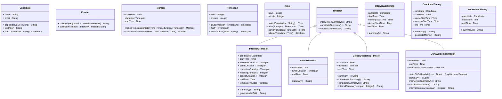

```mermaid
classDiagram

class Candidate {
    + name : String
    + email : String
    + capitalize(value : String) String
    + toString() String
    + static Parse(line : String) Candidate
}

class Emailer {
    + buildSubject(timeslot : InterviewTimeslot) String
    + buildBody(timeslot : InterviewTimeslot) String
}

class Moment {
    + startTime : Time
    + duration : Timespan
    + endTime : Time
    + static FromDuration(startTime : Time, duration : Timespan) Moment
    + static FromTime(startTime : Time, endTime : Time) Moment
}

class Timespan {
    + hour : Integer
    + minute : Integer
    + plus(timespan : Timespan) : Timespan
    + half() : Timespan
    + static Parse(value : String) : Timespan
}

class Time {
    + hour : Integer
    + minute : Integer
    + static Parse(value : String) : Time
    + after(timespan : Timespan) : Time
    + earlier(timespan : Timespan) : Time
    + isLaterThan(time : Time) : Boolean
}

class Timeslot {
    + interviewerSummary() : String
    + candidateSummary() : String
    + supervisorSummary() : String
}

class InterviewTimeslot {
    + candidate : Candidate
    + startTime : Time
    + welcomeDuration : Timespan
    + casusDuration : Timespan
    + correctionDuration : Timespan
    + meetingDuration : Timespan
    + debriefDuration : Timespan
    + endTime : Time
    + templateProvider : Function
    + summary() : String
    + generateMailTo() : String
}

class LunchTimeslot {
    + startTime : Time
    + lunchDuration : Timespan
    + endTime : Time
    + summary() : String
}

class GlobalDebriefingTimeslot {
    + startTime : Time
    + duration : Timespan
    + endTime : Time
    + summary() : String
    + interviewerSummary() : String
    + candidateSummary() : String
    + internalSummary(colspan : Integer) : String
}

class JuryWelcomeTimeslot {
    + startTime : Time
    + endTime : Time
    + static welcomeDuration : Timespan
    + static ToBeReadyAt(time : Time) : JuryWelcomeTimeslot
    + summary() : String
    + interviewerSummary() : String
    + candidateSummary() : String
    + internalSummary(colspan : Integer) : String
}

class InterviewerTiming {
    - candidate : Candidate
    - startTime : Time
    - meetingStartTime : Time
    - debriefStartTime : Time
    - endTime : Time
    + summary() : String
}

class CandidateTiming {
    - candidate : Candidate
    - startTime : Time
    - pauseStartTime : Time
    - meetingStartTime : Time
    - endTime : Time
    + summary() : String
    + generateMailTo() : String
}

class SupervisorTiming {
    - candidate : Candidate
    - startTime : Time
    - endTime : Time
    + summary() : String
}

Timeslot <|-- InterviewTimeslot
Timeslot <|-- LunchTimeslot
Timeslot <|-- GlobalDebriefingTimeslot
Timeslot <|-- JuryWelcomeTimeslot
```