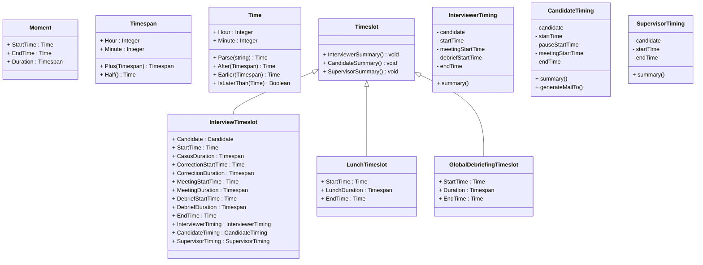

```mermaid
classDiagram

class Moment {
    + StartTime : Time
    + EndTime : Time
    + Duration : Timespan
}

class Timespan {
    + Hour : Integer
    + Minute : Integer
    + Plus(Timespan) Timespan
    + Half() Time
}

class Time {
    + Hour : Integer
    + Minute : Integer
    + Parse(string) Time
    + After (Timespan) Time
    + Earlier (Timespan) Time
    + IsLaterThan(Time) Boolean
}

class Timeslot {
    + InterviewerSummary() void
    + CandidateSummary() void
    + SupervisorSummary() void
}

class InterviewTimeslot {
    + Candidate : Candidate
    + StartTime : Time
    + CasusDuration : Timespan
    + CorrectionStartTime : Time
    + CorrectionDuration : Timespan
    + MeetingStartTime : Time
    + MeetingDuration : Timespan
    + DebriefStartTime : Time
    + DebriefDuration : Timespan
    + EndTime : Time
    + InterviewerTiming : InterviewerTiming
    + CandidateTiming : CandidateTiming
    + SupervisorTiming : SupervisorTiming
}

class LunchTimeslot {
    + StartTime : Time
    + LunchDuration : Timespan
    + EndTime : Time
}

class GlobalDebriefingTimeslot {
    + StartTime : Time
    + Duration : Timespan
    + EndTime : Time
}

Timeslot <|-- InterviewTimeslot
Timeslot <|-- LunchTimeslot
Timeslot <|-- GlobalDebriefingTimeslot

class InterviewerTiming {
        - candidate
        - startTime
        - meetingStartTime
        - debriefStartTime
        - endTime
        + summary()
    }

    class CandidateTiming {
        - candidate
        - startTime
        - pauseStartTime
        - meetingStartTime
        - endTime
        + summary()
        + generateMailTo()
    }

    class SupervisorTiming {
        - candidate
        - startTime
        - endTime
        + summary()
    }
```